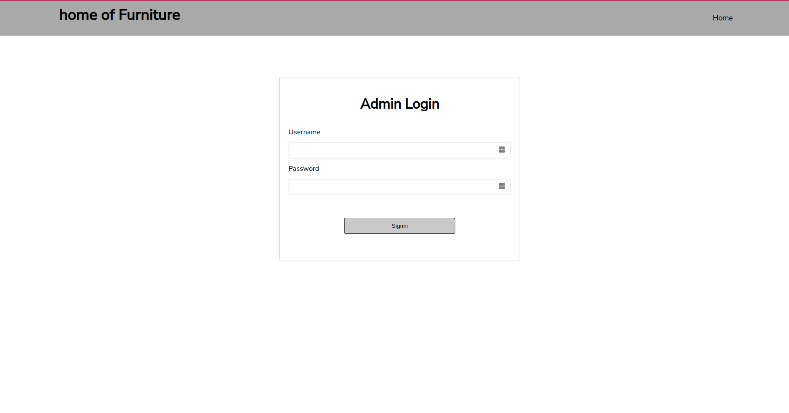

# home-of-furniture-frontend

## Table of Content

- [Introduction](#introduction)
- [Deployment Links](#deployment-links)
- [Project Features](#project-features)
- [Technologies Used](#technologies-used)
- [Installation](#installation--set-up)
- [Contributions](#contributions)
- [Bugs & Feature Request](#bugs--fixes--feature-request)
- [Author](#author)

## Introduction

This is an inventory listing system to add, update and delete items displayed to the users.

Admins can see what's being displayed to users and do necessary updates. Users can therefore view an updated list of available items.

To access admin page switch to `/login`. The app has one user with a `username:` `admin` and a `password` of `1234`

## Deployment Links

Links to other files that relate to this API are:

- [Deployed API URL](https://home-of-furniture-api-production.up.railway.app/products)
- [React Frontend github](https://github.com/codingvaleria/home-of-furniture-frontend)
- [Deployed Frontend URL](https://home-of-furnitures-frontend.vercel.app/)

## Project Features

### Fonts

The fonts have been used for this project:

1. [Nunito (Google Fonts)](https://fonts.google.com/?query=Nunito)

## Images

The following are the images and textures used for this project:

1. [Photo by Jean-Philippe Delberghe](https://images.unsplash.com/photo-1551298370-9d3d53740c72?ixlib=rb-4.0.3&ixid=MnwxMjA3fDB8MHxwaG90by1wYWdlfHx8fGVufDB8fHx8&auto=format&fit=crop&w=687&q=80).

1. [Photo by Spacejoy ](https://images.unsplash.com/photo-1618220179428-22790b461013?ixlib=rb-4.0.3&ixid=MnwxMjA3fDB8MHxzZWFyY2h8NXx8ZnVybml0dXJlfGVufDB8fDB8fA%3D%3D&auto=format&fit=crop&w=700&q=60).

1. [Photo by unsplash in collaboration with Getty Images](https://plus.unsplash.com/premium_photo-1663013668671-d453f319544f?ixlib=rb-4.0.3&ixid=MnwxMjA3fDB8MHxzZWFyY2h8MXx8ZnVybml0dXJlfGVufDB8fDB8fA%3D%3D&auto=format&fit=crop&w=700&q=60).

1. [Photo by Spacejoy ](https://images.unsplash.com/photo-1615874959474-d609969a20ed?ixlib=rb-4.0.3&ixid=MnwxMjA3fDB8MHxzZWFyY2h8NHx8YmVkcm9vbXxlbnwwfHwwfHw%3D&auto=format&fit=crop&w=500&q=60).

## Pages

The heirarchy of the application is as follows:

## Navigation Bar

This page allows users and admin to navigate through different pages

## Landing/Users view page/products page

Displays available furnitures in the shop

## Login page

Displays a form that allows the admin to login to system to add update or delete product

## Add product page

Displays a form to add a new product.

## Product page -

Displays a particular product details

## Technologies Used

- React Library - used to design, structure and add content to the web pages
- CSS - used to styling the pages
- Ruby on rails - used to create the API
- Railways - used to deploy server
- Netlify - used to deploy the front end

## Installation & Set up

1. Clone the repository: `https://github.com/codingvaleria/home-of-furniture-frontend`
2. Install dependecies : `npm install`
3. Run `npm start` on terminal:

## Contributions

1. Fork this repository.
2. Create a branch: `git checkout -b <branch_name>`.
3. Make your changes and commit them: `git commit -m '<commit_message>'`
4. Push to the original branch: `git push origin <project_name>/<location>`
5. Create the pull request.
   Alternatively see the GitHub documentation on [creating a pull
   request](https://help.github.com/en/github/collaborating-with-issues-and-pull-requests/creating-a-pull-request).

## Bugs & Fixes / Feature request

In case you find a bug, kindly open an issue
[here](https://https://github.com/codingvaleria/Auction-Site/issues/new). Include your query
and your expected results.

## Author

- [Valeria Bosibori](https://github.com/xxx)
- Email: codingvaleria@gmail.com

## License

This project is under [MIT](LICENSE).

[Go Back to the Top](#home-of-furniture-frontend)
